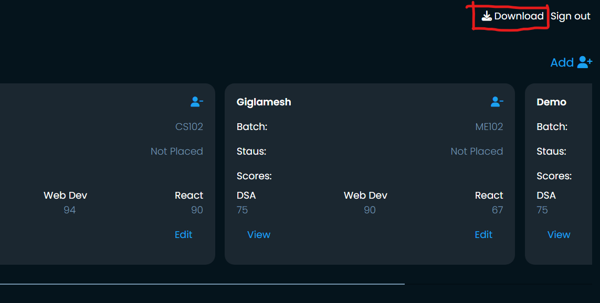

# Placement Cell
A placement cell app backend using nodeJS

## how to setup
npm install <code>libraries found in package.json</code>

-- for <code>mongoDB atlas</code> url has been changed in <code>index.js</code> and <code>mongoose</code>
line no. 98 in index.js and line no. 8 in mongoose.js - change it to localhost/< db_name> to use the local mongoDB server
line 98 -- mongodb://127.0.0.1:27017/ < db name>
line 8 -- mongodb://127.0.0.1:27017/ < db name>

## run the app
npm start 
or
<code>node index.js</code>

## Find the demo on site - please give a bit time to load
<a href="https://placement-cell-52w7.onrender.com" target="_blank"> Link here - live </a>

<a target="_blank" href="https://youtu.be/Se0MS0WF2BA"> video - see features if link doesnt work </a>

## Features to the site
- Batch
- Student Details ( name, status: [placed, not_placed])
- Course Scores (including DSA Final Score, WebD Final Score, React Final Score)
- Interviews (including company name and Date)
- Results (this is a mapping between company, and student, contains result: [PASS, FAIL, On
Hold, Didn’t Attempt])

# Pages
- Sign Up and Sign In only for employees

- List of students

- See student details

- Add a student

- Allocate a student to an interview (edit student page)

- List of Interviews 

- form to create an interview (with date)

- Select an interview to view the list of all students and mark a result status from the list
page itself

 Download a complete CSV of all the data:

- Student id, student name, student college, student status, DSA Final Score, WebD Final
Score, React Final Score, interview date, interview company, interview student result
- A student can have multiple entries based on the interviews she/he has given.

